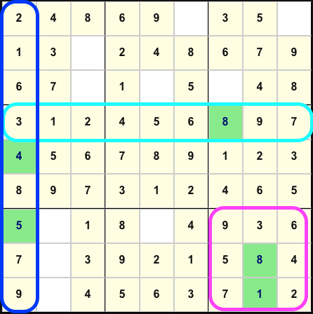

# Sudoku

A responsive random generated sudoku game written in React, TypeScript and Vite.
It consists of four difficulty levels: **Easy**, **Medium**, **Hard**, **Expert**.

## What is Sudoku?

Sudoku grid consists of 9x9 spaces.
There are 9 3x3 block within the grid.
You can only input numbers between 1 to 9.

## How to play?

The row and column has to satisfy the requirement below:

1. Each vertical row can only contain one of 1 to 9 (no duplicate allowed)
2. Each horizontal column can only contain one of 1 to 9 (no duplicate allowed)
3. Each 3x3 block can only contain one of 1 to 9 (no duplicate allowed)

 
    

